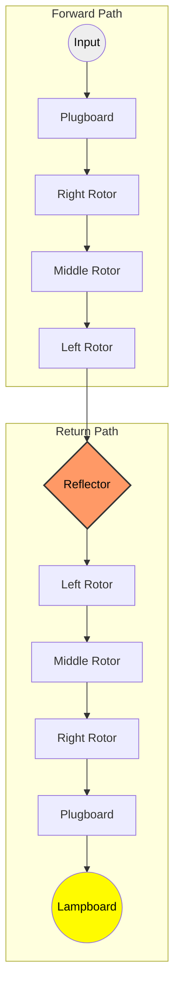

# 📠 Enigma Machine Simulator

<div align="center">
  
  
  
  
</div>

<br/>

A cryptographically and historically accurate simulator of the Enigma machine (M3 model). Built with a high-performance **Rust** engine, a **React/TypeScript** frontend, and bridged together using **Tauri**.

---

## 🗺️ Roadmap
- [x] **Core Engine:** Historical M3 logic in Rust.
- [x] **Basic UI:** React keyboard and lightboard.
- [ ] **Rotor Telemetry:** Real-time visual feedback of rotor positions.
- [ ] **Custom Configurations:** UI for changing rotors and ring settings.
- [ ] **Audio Engine:** Realistic mechanical click sounds for key presses.

---

## 🚀 Tutorials: Getting Started


### Prerequisites
1. **Rust:** Install via [rustup](https://rustup.rs/).
2. **Node.js:** Ensure you have Node and npm installed.
3. **OS Dependencies:** If you are on Linux, you need to install the required Tauri system dependencies (e.g., `webkit2gtk4.1-devel` on Fedora or `libwebkit2gtk-4.1-dev` on Ubuntu). Windows and macOS users are good to go out of the box.

### Installation
Clone the repository and install the frontend dependencies:

```bash
git clone https://github.com/AmStanDem/enigma-machine.git
cd enigma-machine
npm install
```
*(Alternatively, you can use `pnpm` instead of `npm`).*

### Running the App
Start the development server and open the Tauri application:

```bash
npm run tauri dev
```
*(Alternatively, you can use `cargo tauri dev` from the `src-tauri` directory).*

---

## 🛠️ How-To Guides

### How to Encrypt and Decrypt a Message
By default, the application initializes the machine (in `src-tauri/src/main.rs`) with the following historical Wehrmacht configuration:
* **Rotors:** I, II, III
* **Reflector:** B
* **Initial Position (Message Key):** B - A - R

1. Type a sequence of letters (e.g., `H E L L O`) on the virtual keyboard.
2. Note the illuminated letters on the Lightboard (e.g., `X Y Z A B`).
3. **To decrypt:** Restart the application to reset the rotors to `B-A-R`, type the encrypted sequence `X Y Z A B`, and the Lightboard will reveal the original message `H E L L O`. The Enigma cipher is perfectly symmetrical.

### How to Change the Plugboard Settings (Steckerbrett)
Currently, the plugboard swaps are hardcoded in the Rust initialization phase. To change them:
1. Open `src-tauri/src/main.rs`.
2. Locate the `Plugboard::new()` initialization.
3. Add your custom swaps: `plugboard.add_swap('A', 'Z');`
4. Rebuild the app.

---

## 🧠 Explanation (Background & Architecture)

### Why Rust + React?
The Enigma machine requires immense precision in handling mutable states and calculating mathematical offsets. **Rust** ensures memory safety and handles strict typing flawlessly, preventing underflow/overflow bugs during modulo arithmetic. **Tauri** allows us to inject this ultra-fast, historically accurate backend into a modern **React** UI, consuming a fraction of the memory compared to traditional Electron apps.

### Simulating the "Double Stepping" Anomaly
This simulator does not merely substitute letters; it simulates the physical gears. The Rust engine accurately replicates the historical **Double Stepping** mechanical flaw. Because of how the pawls and notches interacted in the original hardware, the middle rotor would occasionally step twice in a row. This exact behavior is faithfully reproduced in the `step_rotors` logic.

### Overcoming Mathematical Underflow
In standard modulo arithmetic `(signal - offset) % 26`, negative numbers can cause panics in strict languages like Rust. The engine safely calculates the electrical path by adding a full alphabet cycle before applying the modulo: `(signal + 26 - offset) % 26`, ensuring absolute mathematical stability during the forward and backward signal routing.

---

## 📚 Technical Reference

### Signal Flow Diagram
The electrical signal follows a symmetrical path. Every keypress triggers a mechanical rotation *before* the current passes through the components:



### Exposed Tauri Commands
* `process_keystroke(key: char) -> Result<char, String>`
  Takes a single uppercase character, triggers the mechanical stepping of the rotors, routes the electrical signal through the components, and returns the encrypted character to the frontend.

### Core Engine Components
The engine is located in `src-tauri/src/enigma.rs` and implements the following logic:
* **Stepping:** Rotors advance before the signal is processed.
* **Double Stepping:** The middle rotor's turnover follows the historical mechanical flaw.
* **Symmetry:** The reflector ensures that if `A` encrypts to `B`, then `B` will decrypt to `A`.

---

## 📖 References & Bibliography

This simulator implements the historical technical specifications of the **Enigma M3 (Heeres Enigma)**. The following sources were used to ensure cryptographic accuracy:

* **Rotor Wiring & Notches:** Verified through the [Crypto Museum Wiring Database](https://www.cryptomuseum.com/crypto/enigma/wiring.htm).
* **Mathematical Logic:** Implementation of offsets and ring settings based on Dirk Rijmenants' technical papers found on the [Crypto Museum Enigma Working Page](https://www.cryptomuseum.com/crypto/enigma/working.htm).
* **Hardware Architecture:** Based on the analysis by Tony Sale (Bletchley Park) at [Codes and Ciphers](https://www.codesandciphers.org.uk/enigma/enigma1.htm).

---
*Created by [Thomas Riotto](https://github.com/AmStanDem)*